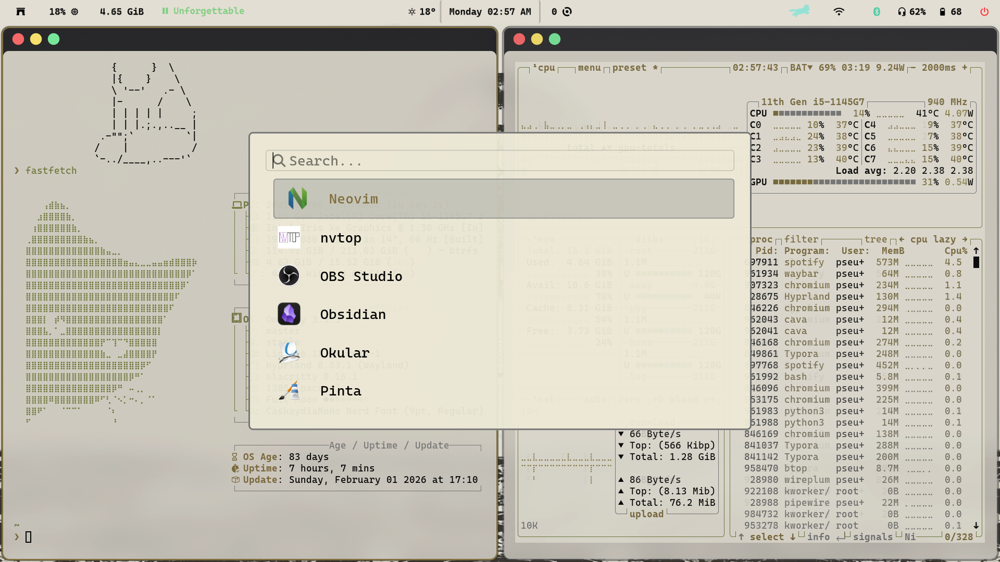
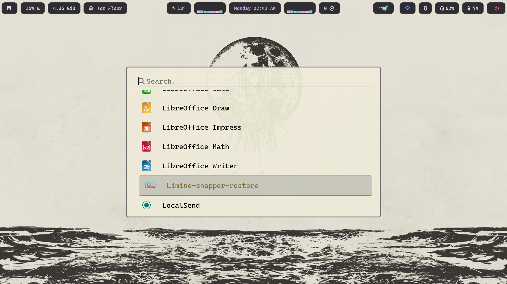
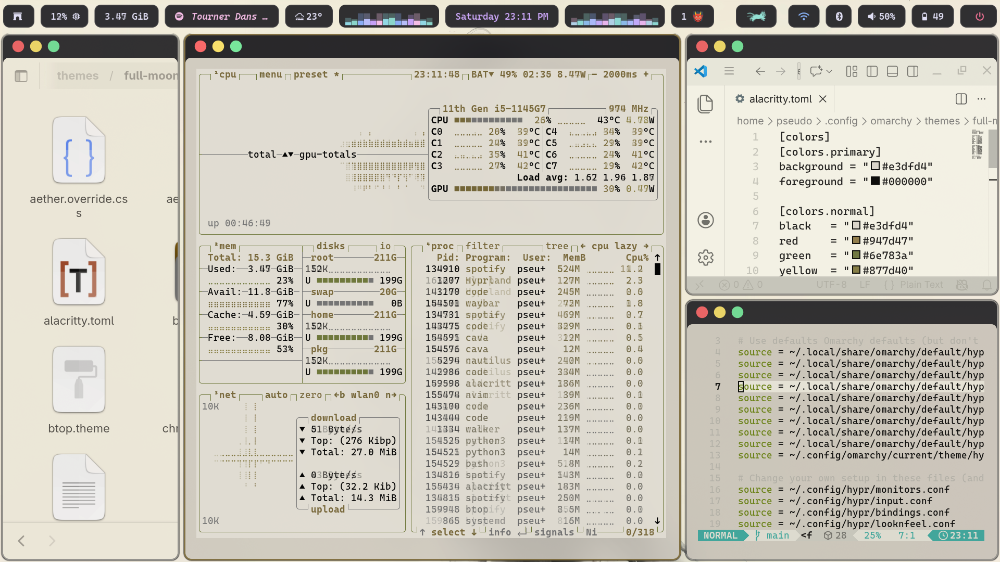

# Dotfiles for Hyprland on Arch Linux

Dotfiles setup with static and dynamic themes and plenty of useful scripts.

<table>
  <tr>
    <td></td>
    <td></td>
  </tr>
  <tr>
    <td></td>
    <td></td>
  </tr>
  <tr>
    <td></td>
    <td></td>
  </tr>
</table>
