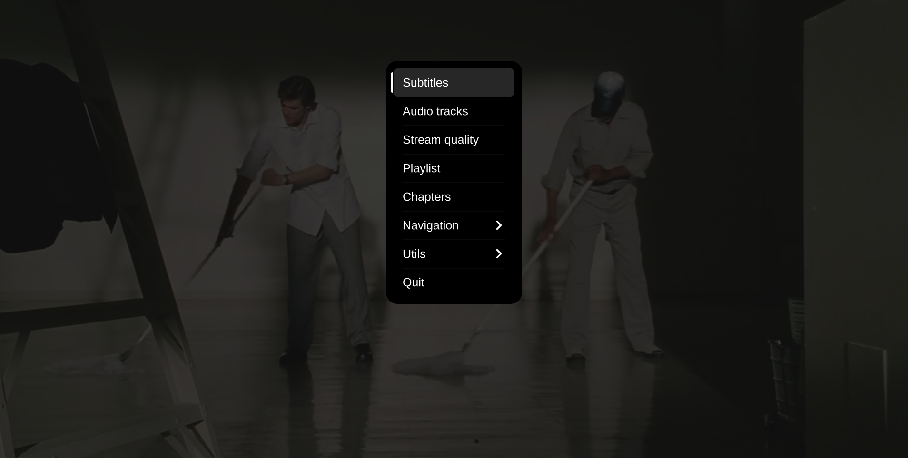

### 🎬 mpv + uosc config

A minimalist, high-performance **mpv** configuration focused on a clean UI and automated workflows. This setup leverages **uosc** for a modern interface and **subliminal** for hands-free subtitle management.

✨ Highlights

- **UI:** Modern, proximity-based controls via `uosc`.
- **Visuals:** High-speed thumbnail previews with `thumbfast`.
- **Automation:** Auto-downloading subtitles via `autosub`.
- **Performance:** GPU-optimized playback using `mpv-smart`.

------

🖼️ Preview

|  |  |
| ------------------ | ------------------ |
|                    |                    |
|                    |                    |

------

📦 Required Packages

| Component      | Description                | Installation                |
| :------------- | :------------------------- | :-------------------------- |
| **mpv**        | Core media player          | `sudo pacman -S mpv`        |
| **uosc**       | Modern UI replacement      | `yay -S mpv-uosc-git`       |
| **thumbfast**  | On-hover thumbnails        | `yay -S mpv-thumbfast-git`  |
| **subliminal** | Subtitle downloader engine | `yay -S subliminal`         |
| **autosub**    | Automatic subtitle script  | `yay -S mpv-autosub-git`    |
| **python-pip** | Required for subliminal    | `sudo pacman -S python-pip` |

------

🔧 Performance Script

This setup includes the **mpv-smart** script for GPU optimization.

- **Path:** `~/.local/share/omarchy/bin/mpv-smart`
- **Permission:** `chmod +x ~/.local/share/omarchy/bin/mpv-smart`

------
