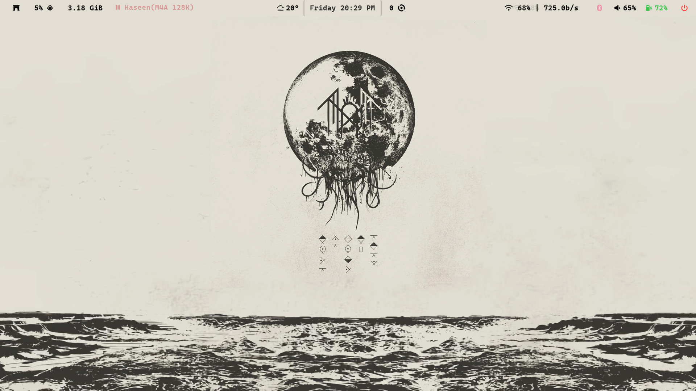
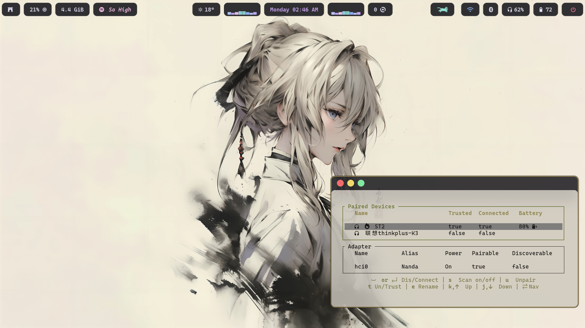

# **Full Moon Theme for Omarchy**

A  light inspired theme for DHH's Omarchy, an opinioned Arch Linux setup.

## Preview

<table>
  <tr>
    <td></td>
    <td></td>
  </tr>
  <tr>
    <td></td>
    <td></td>
  </tr>
  <tr>
    <td></td>
    <td></td>
  </tr>
</table>


### 🌸 Waybar Theme

If you're interested, You may access the Waybar theme configuration  [here.](https://github.com/drunk-particles/waybar.git)  

### Installation

Install on an existing omarchy setup using

```
omarchy-theme-install https://github.com/drunk-particles/Full-Moon.git
```

